# データベース定義 & リレーション仕様書 (DATABASE_SCHEMA.md)

本ドキュメントは、寺岡オートドアSNS（寺子屋SNS）で稼働する **MS SQL Server** の全テーブル定義、カラム制約、主キー・外部キーリレーション、およびローカル JSON フォールバック機構との対応仕様を網羅したものです。

---

## 1. データベースアーキテクチャ概要

- **主要データベース**: Microsoft SQL Server (2016 以降 / Express / Azure SQL)
- **文字コード**: `NVARCHAR` (UTF-16) を多言語・日本語絵文字対応として全面採用
- **主キー体系**: 文字列 ID（例: `u1`, `e-1690000000`, `wf-101`, `rep_20260901_001` 等の UUID またはプレフィックス付きサロゲートキー）
- **耐障害性 (Dual-Persistence)**:
  - バックエンドサーバーは `mssql` プール接続を試み、接続成功時は SQL Server に対してクエリ・MERGE（Upsert）を実行。
  - SQL Server 接続不可・タイムアウト時、またはバックアップ用途として、`/data/*.json` ファイルへの自動読み書き（フォールバック）を透過的に実行。
- **暗号化**:
  - `dbo.Users.personalEmailEncrypted`: 社員の緊急連絡先個人メールアドレスは `AES-256-GCM` により暗号化保存（認証タグとIVを結合して保持）。

---

## 2. データベース ER 図 (Entity Relationship Diagram)

```mermaid
erDiagram
    OfficeMaster ||--o{ Users : "所属"
    DivisionMaster ||--o{ Users : "配属"
    PositionMaster ||--o{ Users : "役職"
    Users ||--o{ Users : "上長 (supervisorId)"

    Users ||--o{ Posts : "投稿 (authorId)"
    Posts ||--o{ PostTags : "タグ (postId)"

    Users ||--o{ Bulletins : "掲示板作成 (authorId)"
    Bulletins ||--o{ BoardComments : "コメント (bulletinId)"
    Bulletins ||--o{ BoardViewers : "閲覧記録 (bulletinId)"
    Users ||--o{ BoardComments : "発言者 (authorId)"
    Users ||--o{ BoardViewers : "閲覧者 (userId)"

    Users ||--o{ Events : "予定参加者/作成者"

    Users ||--o{ Workflows : "申請者 (applicantId)"
    Users ||--o{ Workflows : "承認者 (approverId)"
    ApprovalFlows ||--o{ Workflows : "適用承認フロー"

    Users ||--o{ WorkReports : "報告者 (author_id)"
    Users ||--o{ WorkReports : "承認/査閲者 (supervisor_id)"

    ChatRooms ||--o{ ChatMessages : "メッセージ (roomId)"
    Users ||--o{ ChatMessages : "送信者 (senderId)"

    Users ||--o{ Memos : "伝言作成者 (senderId)"
    Users ||--o{ Memos : "主宛先 (receiverId)"

    Users ||--o{ InspectionReports : "主点検員 (inspectorId)"
    Users ||--o{ InspectionReports : "事務検印者 (officeConfirmedById)"
    Events ||--o{ InspectionReports : "点検予定連動 (eventId)"
    CrmInspections ||--o{ InspectionReports : "CRMデータ連携 (jobNo)"

    SafetyEvents ||--o{ SafetyResponses : "回答集計 (eventId)"
    Users ||--o{ SafetyResponses : "回答者 (userId)"

    Users ||--o{ notifications : "受信者 (user_id)"
    Users ||--o{ push_subscriptions : "購読端末 (user_id)"
    Users ||--o{ UserReadStatuses : "既読管理 (userId)"
```

---

## 3. 全テーブル詳細定義

### 3.1 組織・マスタテーブル

#### ① `dbo.OfficeMaster` (事業所・営業所マスタ)
※ 後方互換のため `dbo.Offices` シノニムが設定されています。

| カラム名 | データ型 | NULL | 初期値 | 説明 |
| :--- | :--- | :---: | :--- | :--- |
| `id` | `VARCHAR(50)` | NO | - | **主キー** (例: `'off-1'`, `'off-tokyo'`) |
| `name` | `NVARCHAR(100)` | NO | - | 拠点・事業所名 (例: `'東京本社'`, `'大阪支社'`) |
| `type` | `VARCHAR(50)` | YES | NULL | 拠点区分 (`'headquarters'`, `'branch'`, `'office'`) |
| `code` | `VARCHAR(50)` | YES | NULL | 拠点コード (例: `'TYO'`, `'OSA'`) |
| `location` | `NVARCHAR(255)` | YES | NULL | 所在地住所 |
| `phone` | `NVARCHAR(50)` | YES | NULL | 代表電話番号 |

#### ② `dbo.DivisionMaster` (部門・部署マスタ)
※ 後方互換のため `dbo.Divisions` シノニムが設定されています。

| カラム名 | データ型 | NULL | 初期値 | 説明 |
| :--- | :--- | :---: | :--- | :--- |
| `id` | `VARCHAR(50)` | NO | - | **主キー** (例: `'div-1'`, `'div-dev'`) |
| `name` | `NVARCHAR(100)` | NO | - | 部署名 (例: `'開発技術部'`, `'営業統括部'`) |
| `code` | `VARCHAR(50)` | YES | NULL | 部署コード |
| `description` | `NVARCHAR(255)` | YES | NULL | 部署の説明・職掌 |

#### ③ `dbo.PositionMaster` (役職マスタ)
※ 後方互換のため `dbo.Positions` シノニムが設定されています。

| カラム名 | データ型 | NULL | 初期値 | 説明 |
| :--- | :--- | :---: | :--- | :--- |
| `id` | `VARCHAR(50)` | NO | - | **主キー** (例: `'pos-1'`, `'pos-mgr'`) |
| `name` | `NVARCHAR(100)` | NO | - | 役職名 (例: `'一般社員'`, `'主任'`, `'課長'`, `'部長'`) |
| `code` | `VARCHAR(50)` | YES | NULL | 役職コード |
| `description` | `NVARCHAR(255)` | YES | NULL | 役職の権限・職責 |

#### ④ `dbo.ItemMasters` (品目・部品マスタ)

| カラム名 | データ型 | NULL | 初期値 | 説明 |
| :--- | :--- | :---: | :--- | :--- |
| `id` | `VARCHAR(50)` | NO | - | **主キー** (品目ID) |
| `name` | `NVARCHAR(200)` | NO | - | 部品・品目名 (例: `'Vベルト'`, `'光電管センサー'`) |
| `category` | `NVARCHAR(100)` | YES | NULL | カテゴリ分類 |
| `defaultUnitPrice` | `INT` | YES | `0` | 標準単価（円） |
| `unit` | `NVARCHAR(50)` | YES | NULL | 単位 (例: `'個'`, `'本'`, `'セット'`) |
| `code` | `VARCHAR(50)` | YES | NULL | 品目型番・コード |

#### ⑤ `dbo.ApprovalFlows` (承認ルートマスタ)

| カラム名 | データ型 | NULL | 初期値 | 説明 |
| :--- | :--- | :---: | :--- | :--- |
| `id` | `VARCHAR(50)` | NO | - | **主キー** (フローID) |
| `name` | `NVARCHAR(200)` | NO | - | 承認フロールート名 |
| `description` | `NVARCHAR(MAX)` | YES | NULL | フロー説明 |
| `targetApplicationType` | `VARCHAR(50)` | YES | NULL | 対象申請種別 (`'purchase'`, `'leave'`, `'repair'`) |
| `stepsJson` | `NVARCHAR(MAX)` | YES | NULL | 承認ステップ構成 JSON (`[{stepNumber, approverType...}]`) |
| `isDefault` | `BIT` | YES | `0` | デフォルトフローフラグ (`1`=デフォルト) |

---

### 3.2 ユーザー・アカウント

#### ⑥ `dbo.Users` (社員・アカウントテーブル)

| カラム名 | データ型 | NULL | 初期値 | 説明 |
| :--- | :--- | :---: | :--- | :--- |
| `id` | `VARCHAR(50)` | NO | - | **主キー** (社員ID、例: `'u1'`, `'u2'`) |
| `loginId` | `VARCHAR(50)` | YES | NULL | ログインID (社員番号) |
| `password` | `VARCHAR(100)` | YES | NULL | パスワード (ハッシュまたは平文互換) |
| `name` | `NVARCHAR(100)` | NO | - | 社員氏名 |
| `department` | `NVARCHAR(100)` | YES | NULL | 部署名 (後方互換用) |
| `avatarUrl` | `NVARCHAR(500)` | YES | NULL | アバター画像URL |
| `office` | `NVARCHAR(100)` | YES | NULL | 所属拠点名 |
| `division` | `NVARCHAR(100)` | YES | NULL | 所属部門名 |
| `position` | `NVARCHAR(100)` | YES | NULL | 役職名 |
| `role` | `VARCHAR(50)` | YES | `'user'` | 権限ロール (`'admin'`, `'user'`, `'manager'`) |
| `isAdmin` | `BIT` | YES | `0` | システム管理者フラグ (`1`=管理者) |
| `supervisorId` | `VARCHAR(50)` | YES | NULL | 直属上長の社員ID (`dbo.Users.id` を自己参照) |
| `personalEmailEncrypted` | `NVARCHAR(500)` | YES | NULL | **緊急安否確認用個人メール (AES-256-GCM暗号化)** |
| `personalEmailMasked` | `NVARCHAR(255)` | YES | NULL | 表示用マスク済みメール (例: `ta***o@gmail.com`) |

---

### 3.3 コミュニケーション & 掲示板

#### ⑦ `dbo.Posts` (社内タイムライン投稿)

| カラム名 | データ型 | NULL | 初期値 | 説明 |
| :--- | :--- | :---: | :--- | :--- |
| `id` | `VARCHAR(50)` | NO | - | **主キー** (投稿ID、例: `'p-1'`) |
| `authorId` | `VARCHAR(50)` | NO | - | 投稿者の社員ID (`dbo.Users.id`) |
| `content` | `NVARCHAR(MAX)` | NO | - | 投稿本文 |
| `createdAt` | `DATETIME` | YES | `GETDATE()` | 投稿日時 |
| `likes` | `INT` | YES | `0` | いいね数 |
| `nasLink` | `NVARCHAR(500)` | YES | NULL | 社内NAS共有フォルダーパス |
| `tags` | `NVARCHAR(500)` | YES | NULL | カンマ区切りタグ文字列 |
| `isLiked` | `BIT` | YES | `0` | いいね状態フラグ |

#### ⑧ `dbo.PostTags` (投稿タグ関連)

| カラム名 | データ型 | NULL | 初期値 | 説明 |
| :--- | :--- | :---: | :--- | :--- |
| `postId` | `VARCHAR(50)` | NO | - | 対象投稿ID (`dbo.Posts.id`) |
| `tag` | `NVARCHAR(100)` | NO | - | タグ名称 |

#### ⑨ `dbo.Bulletins` (全社掲示板・回覧板)

| カラム名 | データ型 | NULL | 初期値 | 説明 |
| :--- | :--- | :---: | :--- | :--- |
| `id` | `VARCHAR(50)` | NO | - | **主キー** (掲示ID、例: `'b-1'`) |
| `title` | `NVARCHAR(255)` | NO | - | 掲示タイトル |
| `content` | `NVARCHAR(MAX)` | NO | - | 掲示本文 (JSONまたはプレーンテキスト) |
| `authorId` | `VARCHAR(50)` | NO | - | 投稿者の社員ID |
| `createdAt` | `DATETIME` | YES | `GETDATE()` | 投稿日時 |
| `category` | `NVARCHAR(50)` | YES | NULL | カテゴリ (`'announcement'`, `'general'`, `'technical'`) |
| `isPinned` | `BIT` | YES | `0` | 上部固定フラグ (`1`=ピン留め) |
| `views` | `INT` | YES | `0` | 閲覧回数 |
| `likes` | `INT` | YES | `0` | いいね数 |
| `office` | `NVARCHAR(100)` | YES | NULL | 対象事業所限定 |
| `division` | `NVARCHAR(100)` | YES | NULL | 対象部門限定 |
| `scope` | `NVARCHAR(50)` | YES | `N'全社'` | 公開範囲 (`'全社'`, `'事業所'`, `'部署'`) |
| `tags` | `NVARCHAR(500)` | YES | NULL | タグ一覧 |
| `attachments` | `NVARCHAR(MAX)` | YES | NULL | 添付ファイルメタ情報 JSON 配列 |

#### ⑩ `dbo.BoardComments` (掲示板コメント)

| カラム名 | データ型 | NULL | 初期値 | 説明 |
| :--- | :--- | :---: | :--- | :--- |
| `id` | `VARCHAR(50)` | NO | - | **主キー** (コメントID) |
| `topicId` | `VARCHAR(50)` | YES | NULL | 掲示板トピックID (互換用) |
| `bulletinId` | `VARCHAR(50)` | YES | NULL | 親掲示板ID (`dbo.Bulletins.id`) |
| `authorId` | `VARCHAR(50)` | NO | - | コメント投稿者の社員ID |
| `content` | `NVARCHAR(MAX)` | NO | - | コメント本文 |
| `createdAt` | `DATETIME` | YES | `GETDATE()` | 投稿日時 |
| `attachments` | `NVARCHAR(MAX)` | YES | NULL | 添付ファイルメタ情報 JSON 配列 |

#### ⑪ `dbo.BoardViewers` (掲示板既読・閲覧者管理)

| カラム名 | データ型 | NULL | 初期値 | 説明 |
| :--- | :--- | :---: | :--- | :--- |
| `topicId` | `VARCHAR(50)` | YES | NULL | 掲示板トピックID |
| `bulletinId` | `VARCHAR(50)` | YES | NULL | 掲示板ID |
| `userId` | `VARCHAR(50)` | NO | - | 閲覧した社員ID (`dbo.Users.id`) |
| `viewedAt` | `DATETIME` | YES | `GETDATE()` | 既読確認日時 |

---

### 3.4 チャット & 伝言メモ

#### ⑫ `dbo.ChatRooms` (チャットルーム)

| カラム名 | データ型 | NULL | 初期値 | 説明 |
| :--- | :--- | :---: | :--- | :--- |
| `id` | `VARCHAR(50)` | NO | - | **主キー** (ルームID、例: `'r1'`) |
| `name` | `NVARCHAR(100)` | NO | - | ルーム名 / 相手氏名 |
| `type` | `NVARCHAR(50)` | YES | `N'group'` | ルーム種別 (`'group'`, `'direct'`) |
| `avatarUrl` | `NVARCHAR(500)` | YES | NULL | ルームアイコン画像URL |
| `lastMessage` | `NVARCHAR(MAX)` | YES | NULL | 最終発言メッセージ抜粋 |
| `updatedAt` | `DATETIME` | YES | `GETDATE()` | 最終更新日時 |
| `last_updated` | `DATETIME` | YES | `GETDATE()` | 互換用更新日時 |
| `participantsJson` | `NVARCHAR(MAX)` | YES | NULL | 参加者社員ID配列 JSON (`["u1", "u3"]`) |

#### ⑬ `dbo.ChatMessages` (チャットメッセージ)

| カラム名 | データ型 | NULL | 初期値 | 説明 |
| :--- | :--- | :---: | :--- | :--- |
| `id` | `VARCHAR(50)` | NO | - | **主キー** (メッセージID、例: `'c-1'`) |
| `roomId` | `VARCHAR(50)` | YES | NULL | 対象ルームID (`dbo.ChatRooms.id`) |
| `senderId` | `VARCHAR(50)` | YES | NULL | 送信者の社員ID |
| `message` | `NVARCHAR(MAX)` | YES | NULL | 本文テキスト |
| `content` | `NVARCHAR(MAX)` | YES | NULL | 互換用本文テキスト |
| `createdAt` | `DATETIME` | YES | `GETDATE()` | 送信日時 |
| `attachments` | `NVARCHAR(MAX)` | YES | NULL | 添付ファイル JSON 配列 |
| `viewersJson` | `NVARCHAR(MAX)` | YES | NULL | 既読社員ID配列 JSON (`["u1", "u2"]`) |

#### ⑭ `dbo.Memos` (電話伝言・不在メモ)

| カラム名 | データ型 | NULL | 初期値 | 説明 |
| :--- | :--- | :---: | :--- | :--- |
| `id` | `VARCHAR(50)` | NO | - | **主キー** (メモID、例: `'memo-1'`) |
| `senderId` | `VARCHAR(50)` | YES | NULL | メモ作成者の社員ID |
| `receiverId` | `VARCHAR(50)` | YES | NULL | メイン受取者の社員ID |
| `toUsersJson` | `NVARCHAR(MAX)` | YES | NULL | 同報宛先社員ID配列 JSON (`["u1", "u3"]`) |
| `fromName` | `NVARCHAR(100)` | YES | NULL | お相手の氏名 |
| `fromCompany` | `NVARCHAR(100)` | YES | NULL | お相手の貴社名 |
| `fromPhone` | `NVARCHAR(50)` | YES | NULL | お相手の電話番号 |
| `requirementType` | `NVARCHAR(50)` | YES | NULL | 用件区分 (`'please_call_back'`, `'will_call_again'`, `'has_message'`, `'visited'`) |
| `content` | `NVARCHAR(MAX)` | NO | - | 伝言本文 |
| `details` | `NVARCHAR(MAX)` | YES | NULL | 詳細情報 |
| `isRead` | `BIT` | YES | `0` | 既読状態フラグ |
| `recipientStatusesJson`| `NVARCHAR(MAX)` | YES | NULL | 各宛先の既読状態 JSON (`{"u3":{"isRead":true,"readAt":"..."}}`) |
| `createdAt` | `DATETIME` | YES | `GETDATE()` | 作成日時 |

---

### 3.5 スケジュール・申請・報告業務

#### ⑮ `dbo.Events` (カレンダー行事・予定・点検スケジュール)

| カラム名 | データ型 | NULL | 初期値 | 説明 |
| :--- | :--- | :---: | :--- | :--- |
| `id` | `VARCHAR(50)` | NO | - | **主キー** (予定ID、例: `'e-1'`) |
| `title` | `NVARCHAR(255)` | NO | - | 予定タイトル (客先名、工事名等) |
| `startAt` | `DATETIME2` | NO | - | 開始日時 (ISO 8601) |
| `endAt` | `DATETIME2` | NO | - | 終了日時 (ISO 8601) |
| `isAllDay` | `BIT` | YES | `0` | 終日予定フラグ (`1`=終日) |
| `isPrivate` | `BIT` | YES | `0` | 非公開・プライベート予定フラグ |
| `category` | `NVARCHAR(50)` | YES | NULL | 予定種別 (`'inspection'`, `'repair'`, `'meeting'`, `'holiday'`) |
| `description` | `NVARCHAR(MAX)` | YES | NULL | 備考・点検メモ・参加者メタ情報 JSON |
| `location` | `NVARCHAR(255)` | YES | NULL | 訪問先住所・場所・現場名 |
| `office` | `NVARCHAR(100)` | YES | NULL | 事業所限定フラグ |
| `division` | `NVARCHAR(100)` | YES | NULL | 部署限定フラグ |
| `attachments` | `NVARCHAR(MAX)` | YES | NULL | 添付ファイル JSON 配列 |
| `recurrence` | `NVARCHAR(MAX)` | YES | NULL | 繰り返しルール JSON (`{freq, interval, daysOfWeek, until}`) |
| `recurrenceParentId` | `VARCHAR(50)` | YES | NULL | 繰り返し元の親イベントID |
| `recurrenceOriginalDate` | `VARCHAR(50)` | YES | NULL | 例外対象の該当日付文字列 (`'YYYY-MM-DD'`) |
| `recurrenceExceptions` | `NVARCHAR(MAX)` | YES | NULL | 除外日配列 JSON (`["2026-09-01"]`) |
| `status` | `VARCHAR(50)` | YES | `'published'` | 状態 (`'published'`, `'draft'`: 点検予定下書き保存) |
| `targetYearMonth` | `VARCHAR(7)` | YES | NULL | 点検スケジューラー対象月度 (`'YYYY-MM'`) |
| `draftSavedAt` | `DATETIME2` | YES | NULL | 点検予定自動保存/下書き保存日時 |

#### ⑯ `dbo.Workflows` (電子申請・ワークフロー)

| カラム名 | データ型 | NULL | 初期値 | 説明 |
| :--- | :--- | :---: | :--- | :--- |
| `id` | `VARCHAR(50)` | NO | - | **主キー** (申請ID、例: `'w-1'`, `'wf-101'`) |
| `title` | `NVARCHAR(255)` | NO | - | 申請件名 |
| `applicantId` | `VARCHAR(50)` | NO | - | 申請者の社員ID (`dbo.Users.id`) |
| `approverId` | `VARCHAR(50)` | YES | NULL | 現在の承認者社員ID (`dbo.Users.id`) |
| `status` | `NVARCHAR(50)` | NO | `N'承認待ち'` | 状態 (`'pending'`, `'approved'`, `'rejected'`, `'draft'`) |
| `category` | `NVARCHAR(50)` | YES | NULL | 申請種別 (`'purchase'`, `'leave'`, `'repair'`, `'expense'`) |
| `type` | `NVARCHAR(50)` | YES | NULL | 申請タイプ名 |
| `details` | `NVARCHAR(MAX)` | YES | NULL | 申請詳細データ JSON (金額、品目明細、ステップ履歴等) |
| `description` | `NVARCHAR(MAX)` | YES | NULL | 申請理由・概要 |
| `attachments` | `NVARCHAR(MAX)` | YES | NULL | 添付ファイル JSON 配列 |
| `purchaseOrderNumber` | `NVARCHAR(100)` | YES | NULL | 発注書番号・稟議番号 |
| `constructionDate` | `NVARCHAR(50)` | YES | NULL | 工事施工日 |
| `linkedInventoryIssueId` | `VARCHAR(50)` | YES | NULL | 部品出庫・資材連携ID |
| `createdAt` | `DATETIME` | YES | `GETDATE()` | 申請日時 |

#### ⑰ `dbo.WorkReports` (日報・週報・工事/点検作業日報)
※ 後方互換のため `dbo.DailyReports` シノニムが設定されています。

| カラム名 | データ型 | NULL | 初期値 | 説明 |
| :--- | :--- | :---: | :--- | :--- |
| `id` | `NVARCHAR(100)` | NO | - | **主キー** (日報・週報ID、例: `'r-weekly-1'`) |
| `author_id` | `NVARCHAR(100)` | NO | - | 報告作成者の社員ID (`dbo.Users.id`) |
| `supervisor_id` | `NVARCHAR(100)` | YES | NULL | 提出先・承認上長の社員ID |
| `week_start_date` | `DATE` | YES | NULL | 対象週の月曜開始日 (`YYYY-MM-DD`) |
| `week_label` | `NVARCHAR(100)` | YES | NULL | 週表示ラベル (例: `'2026年9月1日週'`) |
| `tasks` | `NVARCHAR(MAX)` | YES | NULL | 実施業務内容・タスク一覧 |
| `achievements` | `NVARCHAR(MAX)` | YES | NULL | 成果・進捗状況 |
| `issues` | `NVARCHAR(MAX)` | YES | NULL | 課題・懸念事項・連絡事項 |
| `continued_items` | `NVARCHAR(MAX)` | YES | NULL | 継続案件・次期持ち越し項目 |
| `next_week_plans` | `NVARCHAR(MAX)` | YES | NULL | 翌週予定・目標 |
| `status` | `NVARCHAR(50)` | YES | `N'submitted'` | 状態 (`'draft'`, `'submitted'`, `'reviewed'`) |
| `review_feedback` | `NVARCHAR(MAX)` | YES | NULL | 上長からの講評・レビューコメント |
| `reviewed_at` | `DATETIMEOFFSET`| YES | NULL | 上長査閲・確認完了日時 |
| `createdAt` | `DATETIMEOFFSET`| YES | `SYSDATETIMEOFFSET()`| 作成日時 |
| `updated_at` | `DATETIMEOFFSET`| YES | `SYSDATETIMEOFFSET()`| 更新日時 |

---

### 3.6 点検報告書 & CRM連携

#### ⑱ `dbo.InspectionReports` (定期点検報告書 & 電子署名・検印)

| カラム名 | データ型 | NULL | 初期値 | 説明 |
| :--- | :--- | :---: | :--- | :--- |
| `id` | `NVARCHAR(50)` | NO | - | **主キー** (報告書ID、例: `'rep_20260901_001'`) |
| `eventId` | `NVARCHAR(50)` | YES | NULL | カレンダー予定連動ID (`dbo.Events.id`) |
| `jobNo` | `NVARCHAR(50)` | NO | - | **管理番号・契約番号 (CRMキー)** |
| `inspectionDate` | `NVARCHAR(20)` | YES | NULL | 点検実施日 (`YYYY-MM-DD`) |
| `startTime` | `NVARCHAR(10)` | YES | NULL | 開始時刻 (例: `'09:30'`) |
| `endTime` | `NVARCHAR(10)` | YES | NULL | 終了時刻 (例: `'11:00'`) |
| `weather` | `NVARCHAR(20)` | YES | NULL | 天候 (`'晴'`, `'曇'`, `'雨'`) |
| `inspectorId` | `NVARCHAR(50)` | YES | NULL | 主点検員 社員ID (`dbo.Users.id`) |
| `inspectorName` | `NVARCHAR(100)`| YES | NULL | 主点検員 氏名 |
| `subInspectorName`| `NVARCHAR(100)`| YES | NULL | 副点検員・同行者氏名 |
| `office` | `NVARCHAR(100)`| YES | NULL | 所管事業所名 |
| `customerName` | `NVARCHAR(255)`| NO | - | お客様・物件名 (例: `'丸の内サウスタワー'`) |
| `address` | `NVARCHAR(500)`| YES | NULL | 物件所在地住所 |
| `totalDoorsCount` | `INT` | YES | `1` | 点検対象ドア総台数 (1〜15台) |
| `doorsDetailsJson`| `NVARCHAR(MAX)`| YES | NULL | ドア毎仕様・25項目点検結果 JSON 配列 |
| `checkItemResultsJson`|`NVARCHAR(MAX)`| YES| NULL | 全体点検項目結果（互換用） |
| `overallSummary` | `NVARCHAR(MAX)`| YES | NULL | 総合所見・特記事項 |
| `emergencyRepairMemo`|`NVARCHAR(MAX)`| YES| NULL | 緊急対応・部品交換メモ |
| `status` | `NVARCHAR(20)` | YES | `'draft'` | 状態 (`'draft'`, `'completed'`, `'signed'`) |
| `customerSignature`| `NVARCHAR(MAX)`| YES | NULL | **電子署名 Base64 画像データ (PNG)** |
| `signedCustomerName`|`NVARCHAR(100)`| YES | NULL | ご署名者様 氏名 |
| `signedAt` | `DATETIME2` | YES | NULL | 電子署名受領日時 |
| `officeConfirmed` | `BIT` | YES | `0` | **事務検印確認フラグ (`1`=検印済み)** |
| `officeConfirmedAt`| `DATETIME2` | YES | NULL | 事務検印完了日時 |
| `officeConfirmedById`|`NVARCHAR(50)`| YES | NULL | 事務検印者 社員ID (`dbo.Users.id`) |
| `officeConfirmedByName`|`NVARCHAR(100)`| YES| NULL | 事務検印者 氏名 |
| `createdAt` | `DATETIME2` | YES | `SYSDATETIME()`| 作成日時 |
| `updatedAt` | `DATETIME2` | YES | `SYSDATETIME()`| 更新日時 |

#### ⑲ `dbo.CrmInspections` (CRM点検元データ・ドア仕様台帳)

| カラム名 | データ型 | NULL | 初期値 | 説明 |
| :--- | :--- | :---: | :--- | :--- |
| `jobNo` | `NVARCHAR(50)` | NO | - | **主キー** (物件契約管理番号) |
| `yearMonth` | `NVARCHAR(10)` | YES | NULL | 点検対象年月 (例: `'2026-09'`) |
| `customerName` | `NVARCHAR(255)`| NO | - | お客様・ビル名称 |
| `address` | `NVARCHAR(500)`| YES | NULL | 設置場所住所 |
| `phone` | `NVARCHAR(50)` | YES | NULL | 連絡先電話番号 |
| `doorsCount` | `INT` | YES | `1` | 設置ドア数 |
| `doorsJson` | `NVARCHAR(MAX)`| YES | NULL | 各ドアの仕様マスタ JSON 配列 (機種、製造番号等) |
| `importedAt` | `DATETIME2` | YES | `SYSDATETIME()`| CRMインポート日時 |
| `importedBy` | `NVARCHAR(50)` | YES | NULL | インポート実行者 社員ID |

---

### 3.7 安否確認 (BCP) & 通知インフラ

#### ⑳ `dbo.SafetyEvents` (安否確認発令イベント)

| カラム名 | データ型 | NULL | 初期値 | 説明 |
| :--- | :--- | :---: | :--- | :--- |
| `id` | `NVARCHAR(100)` | NO | - | **主キー** (発令イベントID、例: `'se-1690000000'`) |
| `title` | `NVARCHAR(200)` | NO | - | 発令件名 (例: `'【緊急安否確認】東京湾震源 震度5強'`) |
| `type` | `NVARCHAR(50)` | NO | - | 災害種別 (`'earthquake'`, `'weather'`, `'other'`) |
| `severity` | `NVARCHAR(50)` | YES | `'warning'` | 警戒度 (`'info'`, `'warning'`, `'critical'`) |
| `targetOffice` | `NVARCHAR(100)` | YES | `N'全社'` | 対象事業所 |
| `targetDivision` | `NVARCHAR(100)` | YES | `N'全部署'` | 対象部門 |
| `message` | `NVARCHAR(MAX)` | YES | NULL | 発令メッセージ・指示事項 |
| `notifyWebPush` | `BIT` | YES | `1` | Web Push 通知同時配信フラグ |
| `notifyCompanyEmail`| `BIT` | YES | `1` | 社内メール同時配信フラグ |
| `notifyPersonalEmail`| `BIT` | YES | `1` | 個人緊急連絡先メール同時配信フラグ |
| `isDrill` | `BIT` | YES | `0` | 防災訓練フラグ (`1`=訓練) |
| `status` | `NVARCHAR(50)` | YES | `'active'` | 発令状態 (`'active'`, `'closed'`) |
| `createdBy` | `NVARCHAR(100)` | YES | NULL | 発令者 社員ID |
| `createdByName` | `NVARCHAR(100)` | YES | NULL | 発令者 氏名 |
| `createdAt` | `DATETIMEOFFSET`| YES | `SYSDATETIMEOFFSET()`| 発令日時 |
| `updatedAt` | `DATETIMEOFFSET`| YES | `SYSDATETIMEOFFSET()`| 最終更新日時 |

#### ㉑ `dbo.SafetyResponses` (安否状況回答明細)

| カラム名 | データ型 | NULL | 初期値 | 説明 |
| :--- | :--- | :---: | :--- | :--- |
| `id` | `NVARCHAR(100)` | NO | - | **主キー** (回答ID、例: `'sr-1690000000-u1'`) |
| `eventId` | `NVARCHAR(100)` | NO | - | 発令イベントID (`dbo.SafetyEvents.id`) |
| `userId` | `NVARCHAR(100)` | NO | - | 回答者の社員ID (`dbo.Users.id`) |
| `userName` | `NVARCHAR(100)` | YES | NULL | 社員氏名 |
| `userOffice` | `NVARCHAR(100)` | YES | NULL | 所属事業所 |
| `userDivision` | `NVARCHAR(100)` | YES | NULL | 所属部門 |
| `status` | `NVARCHAR(50)` | NO | - | 本人安否 (`'safe'`=無事, `'injured'`=軽傷, `'critical'`=重傷) |
| `canWork` | `NVARCHAR(50)` | NO | - | 出社・業務可否 (`'immediate'`, `'conditional'`, `'difficult'`) |
| `currentLocation`| `NVARCHAR(50)` | YES | `'home'` | 現在地 (`'home'`, `'office'`, `'transit'`, `'customer'`) |
| `comment` | `NVARCHAR(MAX)` | YES | NULL | 自由連絡事項・家族状況等 |
| `locationCoordinates`|`NVARCHAR(100)`| YES | NULL | GPS位置情報緯度経度 (`"35.6812,139.7671"`) |
| `respondedAt` | `DATETIMEOFFSET`| YES | `SYSDATETIMEOFFSET()`| 回答受信日時 |

#### ㉒ `dbo.notifications` (個別通知キュー・履歴)

| カラム名 | データ型 | NULL | 初期値 | 説明 |
| :--- | :--- | :---: | :--- | :--- |
| `id` | `NVARCHAR(100)` | NO | - | **主キー** (通知ID) |
| `user_id` | `NVARCHAR(100)` | NO | - | 受信者社員ID (`dbo.Users.id`) |
| `sender_id` | `NVARCHAR(100)` | YES | NULL | 発信者社員ID |
| `type` | `NVARCHAR(50)` | NO | - | 通知タイプ (`'safety'`, `'workflow'`, `'memo'`, `'chat'`) |
| `title` | `NVARCHAR(255)` | NO | - | 通知タイトル |
| `contents` | `NVARCHAR(MAX)` | YES | NULL | 通知本文 |
| `target_id` | `NVARCHAR(100)` | YES | NULL | 遷移先リソースID |
| `is_read` | `BIT` | YES | `0` | 既読フラグ (`1`=既読) |
| `created_at` | `DATETIMEOFFSET`| YES | `SYSDATETIMEOFFSET()`| 送信日時 |

#### ㉓ `dbo.push_subscriptions` (Web Push 端末購読情報)

| カラム名 | データ型 | NULL | 初期値 | 説明 |
| :--- | :--- | :---: | :--- | :--- |
| `id` | `NVARCHAR(100)` | NO | - | **主キー** (購読ID) |
| `user_id` | `NVARCHAR(100)` | NO | - | 端末所有者の社員ID (`dbo.Users.id`) |
| `endpoint` | `NVARCHAR(1000)`| NO | - | Push サービスエンドポイントURL |
| `p256dh` | `NVARCHAR(500)` | YES | NULL | 公開鍵 (P-256 Elliptic Curve) |
| `auth` | `NVARCHAR(500)` | YES | NULL | 認証シークレットキー |
| `subscription_json`|`NVARCHAR(MAX)`| NO | - | 購読情報完全体 JSON |
| `user_agent` | `NVARCHAR(500)` | YES | NULL | 端末ブラウザ情報 |
| `created_at` | `DATETIMEOFFSET`| YES | `SYSDATETIMEOFFSET()`| 登録日時 |
| `last_active_at` | `DATETIMEOFFSET`| YES | `SYSDATETIMEOFFSET()`| 最終プッシュ成功日時 |

#### ㉔ `dbo.system_settings` (システム設定・キー永続化)

| カラム名 | データ型 | NULL | 初期値 | 説明 |
| :--- | :--- | :---: | :--- | :--- |
| `setting_key` | `NVARCHAR(100)` | NO | - | **主キー** (設定キー名、例: `'VAPID_KEYS'`) |
| `setting_value` | `NVARCHAR(MAX)` | NO | - | 設定値 (JSONまたは暗号化文字列) |
| `updated_at` | `DATETIMEOFFSET`| YES | `SYSDATETIMEOFFSET()`| 更新日時 |

#### ㉕ `dbo.UserReadStatuses` (未読・既読統合管理テーブル)

| カラム名 | データ型 | NULL | 初期値 | 説明 |
| :--- | :--- | :---: | :--- | :--- |
| `userId` | `VARCHAR(50)` | NO | - | **複合主キー1** 社員ID (`dbo.Users.id`) |
| `targetType` | `VARCHAR(50)` | NO | - | **複合主キー2** 種別 (`'event'`, `'topic'`, `'memo'`, `'chat'`) |
| `targetId` | `VARCHAR(50)` | NO | - | **複合主キー3** 対象レコードID |
| `readAt` | `DATETIME` | YES | `GETDATE()` | 既読完了日時 |

---

## 4. Local JSON ファイルとの対応一覧

| SQL Server テーブル | ローカル JSON ファイル | 主キーキー名 | 役割 / 運用上の留意事項 |
| :--- | :--- | :--- | :--- |
| `dbo.InspectionReports` | `/data/inspection_reports.json` | `id` | 点検報告書・電子署名・事務確認の二重永続化 |
| `dbo.CrmInspections` | `/data/crm_inspections.json` | `jobNo` | CRMからインポートされた点検対象ドア仕様台帳 |
| `dbo.SafetyEvents` | `/data/safety_events.json` | `id` | 安否確認イベント発令履歴 |
| `dbo.SafetyResponses` | `/data/safety_responses.json` | `id` | 社員からの安否確認回答データ |
| `dbo.Events` | `/data/events.json` | `id` | カレンダー予定・点検スケジューラー下書き |
| `dbo.Workflows` | `/data/workflows.json` | `id` | 稟議・購入申請・有給休暇データ |
| `dbo.WorkReports` | `/data/work_reports.json` | `id` | 日報・週報・作業実績データ |
| `dbo.Bulletins` | `/bulletins.json` / `/data/board.json`| `id` | 全社連絡板・掲示板トピック |
| `dbo.BoardComments` | `/data/board_comments.json` | `id` | 掲示板返信コメント |
| `dbo.ChatRooms` | `/data/chat_rooms.json` | `id` | チャットグループ / ダイレクト対話 |
| `dbo.ChatMessages` | `/data/chat_messages.json` | `id` | 各チャットメッセージ本文・添付 |
| `dbo.Memos` | `/data/memos.json` | `id` | 電話伝言メモ |
| `dbo.push_subscriptions` | `/data/push-subscriptions.json` | `id` | Web Push 登録端末一覧 |
