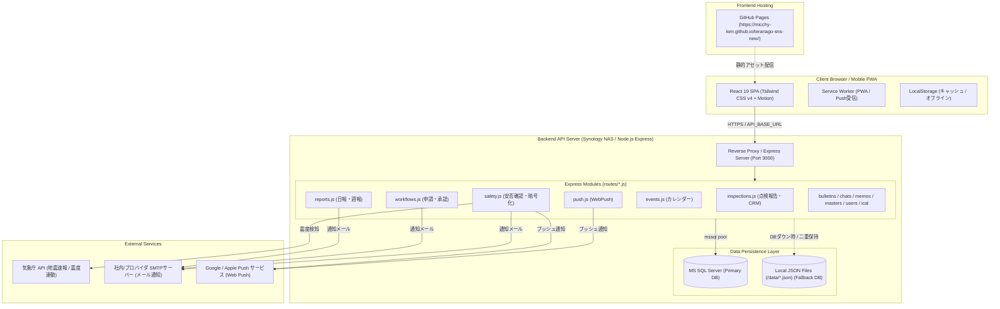

# 寺岡オートドアSNS (寺子屋SNS) システム設計・運用保守ドキュメント (DOC)

本ドキュメント群は、**寺岡オートドアSNS（寺子屋SNS）**の長期的な保守・改修・安全な運用を支援するために、データベース構造、API仕様、および複雑な業務処理フローを網羅的にまとめた公式技術仕様書です。

---

## 📚 ドキュメント構成一覧

| ドキュメント | ファイル名 | 主な内容 |
| :--- | :--- | :--- |
| **全テーブル定義 & リレーション一覧** | [`DATABASE_SCHEMA.md`](./DATABASE_SCHEMA.md) | MS SQL Server (Primary) および Local JSON (Fallback) の全テーブル定義、カラム型、制約、外部キーリレーション、Mermaid ER図 |
| **APIエンドポイント仕様書** | [`API_SPECIFICATION.md`](./API_SPECIFICATION.md) | 全REST APIエンドポイント一覧（HTTPメソッド、マウントパス、処理ロジック、関連テーブル、リクエスト/レスポンス仕様） |
| **主要・複雑業務の処理フロー** | [`SYSTEM_WORKFLOWS.md`](./SYSTEM_WORKFLOWS.md) | ①CRM点検データ〜点検報告書〜電子署名〜事務検印 ②気象庁連動安否確認・AES暗号化同報配信 ③多段階ワークフロー申請・承認 ④カレンダー繰返し・iCal連携 ⑤Web Push & SMTPメール通知基盤 |

---

## 🏗 システム全体アーキテクチャ

本システムは、高い耐障害性と現場の操作性を両立するため、**フロントエンド（GitHub Pages静的SPA）**と**オンプレミス/NASバックエンド（Synology NAS / Node.js Express）**を分離したクロスオリジン構成を採用しています。

---

## ⚙️ 開発・運用における最重要規約 (AGENTS.md 要約)

1. **`server.ts` と `RecommendServerCode.ts` の完全同期**
   - バックエンドの修正時は、UIの管理画面から最新サーバーコードをコピー・エクスポートできるよう、必ず `/src/components/RecommendServerCode.ts` と更新日時を同時更新する。
2. **モジュール分割サーバー（`routes/*.js`）の完全同期**
   - モジュール修正時は、チャット上でファイル全体の完全版コードを提示し、`/routes/*.js`、`/server.ts`、`/src/components/RecommendServerCode.ts` をすべて整合させる。
3. **フロントエンド通信時の `API_BASE_URL` 必須利用**
   - 相対パス (`/api/...`) の直接ハードコードは厳禁。`import { API_BASE_URL } from '../config/api'` を介してリクエストを行う（GitHub Pages 上での 405 Method Not Allowed を防ぐため）。
4. **ハイブリッドDB耐障害性**
   - MS SQL Server への接続プールが切断された場合でも、ローカル JSON (`/data/*.json`) で業務が継続できるようフォールバック機構を維持する。
