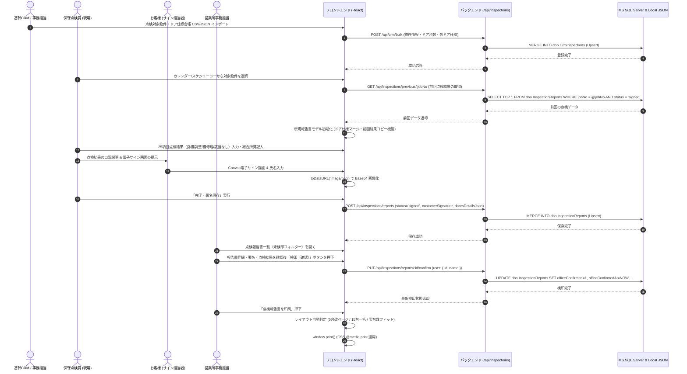
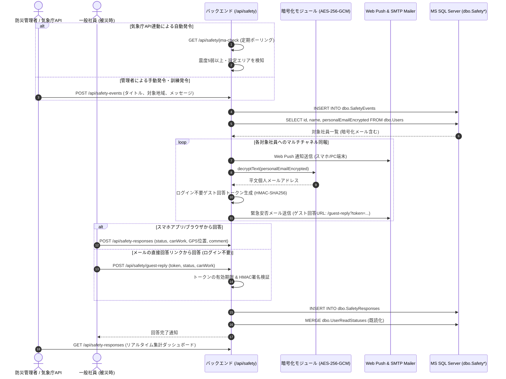
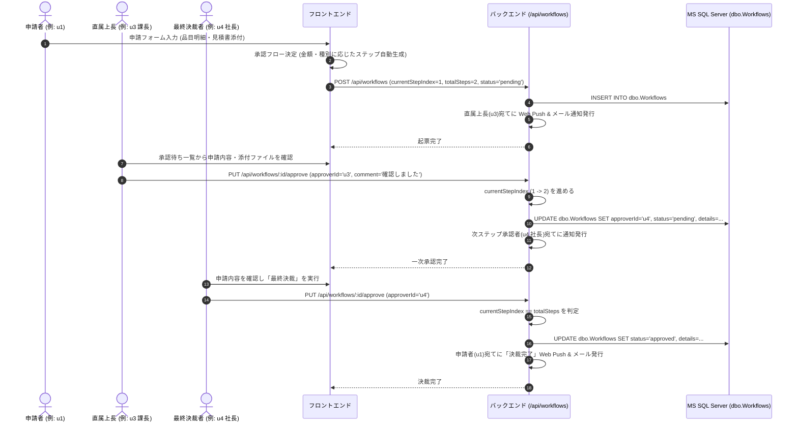

# 主要・複雑業務の処理フロー仕様書 (SYSTEM_WORKFLOWS.md)

本ドキュメントは、寺岡オートドアSNS（寺子屋SNS）において、特に高い耐障害性・セキュリティ・業務連動性が要求される**主要な複雑処理のアーキテクチャおよび処理フロー**を網羅的に解説したものです。

---

## 1. CRM点検連携 〜 報告書作成 〜 電子署名 〜 事務検印 〜 A4印刷フロー

### 1.1 業務概要
社内基幹CRMに登録されている顧客の自動ドア設備台帳データをインポートし、現場技術員による点検入力、お客様からのタブレット電子署名、営業所事務担当者による検印確認、全国自動ドア協会（JADA）基準に準拠したA4帳票出力までを一元管理します。

### 1.2 処理フローシーケンス図 (Mermaid)



### 1.3 核心ロジックと技術的工夫
1. **多台数対応レイアウト自動判定 (`InspectionReportPrintView.tsx`)**:
   - 1物件あたり1台〜最大15台までの自動ドア点検に対応。
   - 1〜5台の場合は実台数に合わせて列幅を均等配分。
   - 6台以上の場合は、現場の要望に応じて「5台ごとの改ページ出力（標準）」と「15台一括横長ワイド出力」をワンタップで切り替え可能。
2. **JADA基準25点検項目マスターの動的カスタマイズ (`InspectionMasterStorage.ts`)**:
   - 全国自動ドア協会の点検25項目（機械室、ドアハンガー、検出装置、制御盤、本体、補助装置）を網羅。
   - 営業所・管理者権限により、独自項目の追加や表示非表示、初期判定値のカスタマイズが即時反映されます。

---

## 2. 安否確認 (BCP) 〜 気象庁速報連動 〜 暗号化同報配信 〜 ゲスト回答フロー

### 2.1 業務概要
地震・台風等の大災害発生時、全社従業員の生命と安全を最速で確認するためのBCPシステムです。気象庁の地震APIと常時連動し、震度5弱以上の地震を検知した際は自動で発令・同報通知を行います。また、社員の個人緊急連絡先メールアドレスは厳格な暗号化下で保護されています。

### 2.2 処理フローシーケンス図 (Mermaid)



### 2.3 暗号化仕様 (AES-256-GCM)
- **保管カラム**: `dbo.Users.personalEmailEncrypted`
- **暗号方式**: `AES-256-GCM` (Galois/Counter Mode)
- **フォーマット**: `{12バイトIV (Hex)}:{16バイトAuthTag (Hex)}:{暗号文 (Hex)}`
- **利点**: 改ざん検知（Integrity Check）が可能であり、平文メールアドレスがDB漏洩時にも第三者に閲覧されるリスクを完全に遮断。
- **UI表示**: 社員本人の設定画面では `ta***o@gmail.com` のようにマスキングして返却（平文は返却しない）。

---

## 3. 多段階電子申請・ワークフロー承認フロー

### 3.1 業務概要
備品・高額機器購入申請、有給休暇申請、修理申請などを電子起票し、組織マスタに基づいた多段階（一次承認：直属上長 → 二次承認：部門長 → 最終決裁：代表取締役）の承認リレーを行います。

### 3.2 処理フローシーケンス図 (Mermaid)



---

## 4. カレンダー・点検スケジュール・iCal 連携フロー

### 4.1 業務概要
社内スケジュール、拠点・部署行事、および自動ドア定期点検予定をカレンダー上で統合管理します。RFC 5545（iCalendar規格）に準拠した外部カレンダー（Outlook, Google Calendar, iPhone カレンダー等）との相互インポート・エクスポートに対応しています。

### 4.2 処理フローと特徴
1. **点検スケジューラー連携**:
   - `dbo.Events` の `targetYearMonth` と `status='draft'` カラムを利用し、翌月・次期点検予定の事前割り当て（ドラフト状態）を安全に保持。
   - 確定時に `status='published'` となり、現場技術員のモバイル端末に点検予定として正式配信。
2. **繰り返し予定 (RRULE) 展開エンジン (`src/utils/recurrenceUtils.ts`)**:
   - 毎週・毎月・毎年の定期予定を展開する際、DBに無限件のレコードを作成するのではなく、親イベント1件（`recurrence` ルールJSON）からクライアント表示期間（月表示・週表示）に合わせて動的展開。
   - 特定日のみの日程変更・除外（`recurrenceExceptions`）をサポート。
3. **iCalendar (.ics) 同期 (`routes/ical.js`)**:
   - `GET /api/ical/export`: 全社行事および個人担当予定を動的に `.ics` 形式でストリーミング生成。
   - `POST /api/ical/import`: Outlook等からエクスポートされた `.ics` ファイルを `mailparser` / `ical.js` でパースし、重複を検知しながら `dbo.Events` に一括インポート。

---

## 5. Web Push & SMTP メール通知パイプライン

### 5.1 概要
ユーザーがアプリを開いていない状態でも、緊急安否確認、ワークフロー承認依頼、新着伝言メモ、チャット着信を確実に届けるためのハイブリッド通知機構です。

### 5.2 ディープリンク自動解決 (`server.ts: resolveDeepLinkUrl`)
通知をクリックした際、対象のリソース（申請ID、掲示板トピックID、点検報告書ID、安否確認イベントID）が直接開くディープリンクをサーバーサイドで自動生成します。

```javascript
// ディープリンク解決ロジック抜粋
if (data.safetyEventId) return `/?tab=safety_confirmation&safetyEventId=${data.safetyEventId}`;
if (data.applicationId) return `/?tab=workflow&appId=${data.applicationId}`;
if (data.reportId)      return `/?tab=daily_report&reportId=${data.reportId}`;
if (data.bulletinId)    return `/?tab=board&topicId=${data.bulletinId}`;
if (data.memoId)        return `/?tab=memo&memoId=${data.memoId}`;
```

### 5.3 配信の耐障害性
- **Web Push**: VAPID暗号化キーを永続化（`data/vapid-keys.json` または `dbo.system_settings`）。無効になった古い購読エンドポイント（410 Gone / 404 Not Found）は自動的にDBから削除クリーンアップ。
- **SMTP メール**: 送信先サーバーの一時的な不達やポート閉塞時にも、プロセス停止（クラッシュ）を防ぐ try-catch ハンドリングを徹底。テスト環境や非接続環境ではシミュレーションモードとして正常終了を返却。
